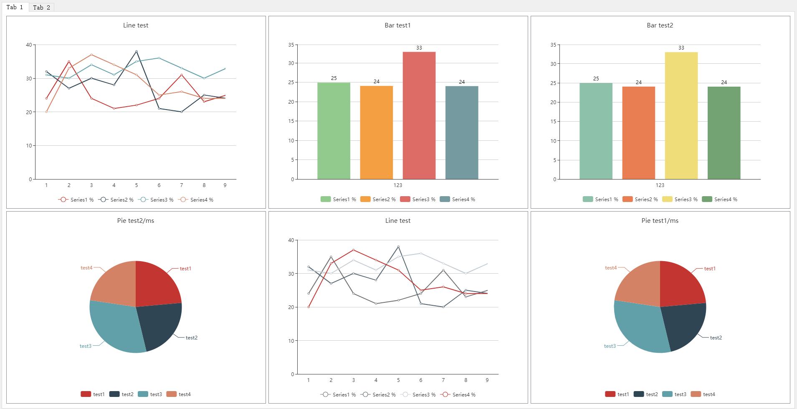

# PyQtECharts: Introduce ECharts for PyQt5

1. This repo provide a simple demo to show using ECharts in PyQt5. We use *qtcreator* create/modify the ui file *mainwindow.ui*, then convert *mainwindow.ui* to *mainwindow_ui.py* with command:

   ```shell
   pyuic5 -o mainwindow_ui.py mainwindow.ui
   ```

2. Requiements:

   ```shell
   PyQt5=5.15 or 5.12，PyQt5-sip=12.8.1，PyQtWebEngine=5.12
   ```

3. How to run:

   a. set the ***htmlfile*** with correct file path in ***main.py***

   b. open terminal and run:

   ```python
   python main.py
   ```

4. Currently, it supports 3 styles: Line, Bar, Pie, shown in below; ECharts has lots of styles, you can introduce new styles based on this repo.

   

5. references

   [1] https://echarts.apache.org/examples/en/index.html#chart-type-line